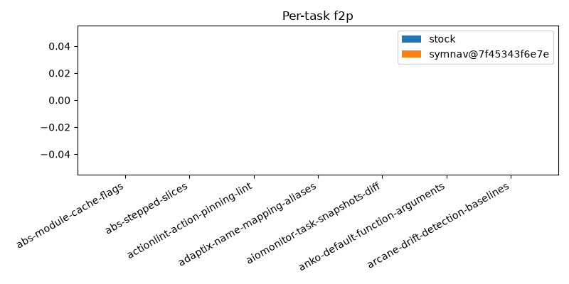
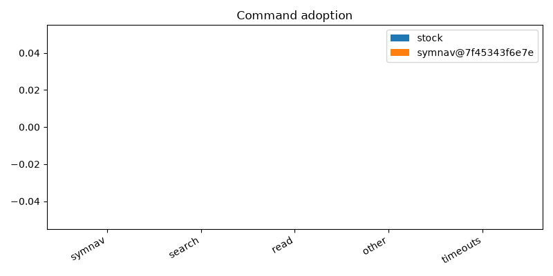
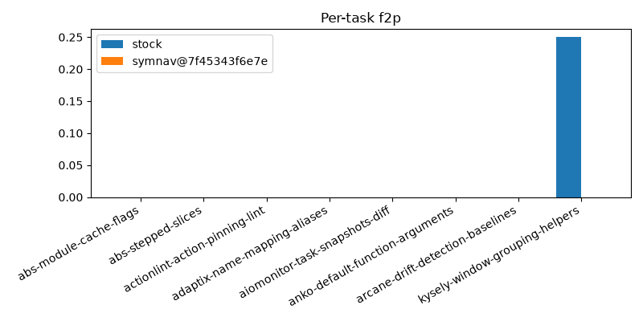
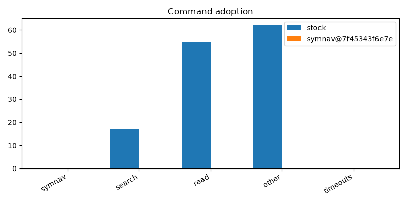
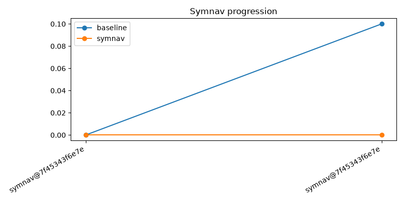

# symnav bench report

Costs are `cost_usd_imputed` from Pier output.

## claude:claude-opus-4-8:high:stock vs claude:claude-opus-4-8:high:symnav@7f45343f6e7e

| metric | left | right |
| --- | ---: | ---: |
| mean f2p | 0.000 | 0.000 |
| solved rate | 0.000 | 0.000 |
| matched solved tasks | 0 | 0 |
| matched cost_usd_imputed | n/a | n/a |
| matched tokens | n/a | n/a |
| matched steps | n/a | n/a |

Matched-set efficiency only includes tasks solved by both arms.

Holes:
- missing arm for anko-default-function-arguments
- missing arm for arcane-drift-detection-baselines
- claude-claude-opus-4-8-high-stock-abs-module-cache-flags-rep2 status=error
- claude-claude-opus-4-8-high-stock-abs-stepped-slices-rep2 status=error
- claude-claude-opus-4-8-high-stock-actionlint-action-pinning-lint-rep2 status=error
- claude-claude-opus-4-8-high-stock-adaptix-name-mapping-aliases-rep2 status=error
- claude-claude-opus-4-8-high-stock-aiomonitor-task-snapshots-diff-rep2 status=error
- claude-claude-opus-4-8-high-symnav@7f45343f6e7e-abs-module-cache-flags-rep2 status=error
- claude-claude-opus-4-8-high-symnav@7f45343f6e7e-abs-stepped-slices-rep2 status=error
- claude-claude-opus-4-8-high-symnav@7f45343f6e7e-actionlint-action-pinning-lint-rep2 status=error
- claude-claude-opus-4-8-high-symnav@7f45343f6e7e-adaptix-name-mapping-aliases-rep2 status=error
- claude-claude-opus-4-8-high-symnav@7f45343f6e7e-aiomonitor-task-snapshots-diff-rep2 status=error
- claude-claude-opus-4-8-high-symnav@7f45343f6e7e-anko-default-function-arguments-rep2 status=error
- claude-claude-opus-4-8-high-symnav@7f45343f6e7e-arcane-drift-detection-baselines-rep2 status=error

## codex:gpt-5.4:xhigh:stock vs codex:gpt-5.4:xhigh:symnav@7f45343f6e7e

| metric | left | right |
| --- | ---: | ---: |
| mean f2p | 0.100 | 0.000 |
| solved rate | 0.100 | 0.000 |
| matched solved tasks | 0 | 0 |
| matched cost_usd_imputed | n/a | n/a |
| matched tokens | n/a | n/a |
| matched steps | n/a | n/a |

Matched-set efficiency only includes tasks solved by both arms.

Holes:
- missing arm for anko-default-function-arguments
- missing arm for arcane-drift-detection-baselines
- missing arm for kysely-window-grouping-helpers
- codex-gpt-5.4-xhigh-stock-abs-module-cache-flags-rep2 status=error
- codex-gpt-5.4-xhigh-stock-abs-module-cache-flags-rep999 status=error
- codex-gpt-5.4-xhigh-stock-abs-stepped-slices-rep2 status=error
- codex-gpt-5.4-xhigh-stock-actionlint-action-pinning-lint-rep2 status=error
- codex-gpt-5.4-xhigh-stock-adaptix-name-mapping-aliases-rep2 status=error
- codex-gpt-5.4-xhigh-stock-aiomonitor-task-snapshots-diff-rep2 status=error
- codex-gpt-5.4-xhigh-stock-kysely-window-grouping-helpers-rep1000 status=error
- codex-gpt-5.4-xhigh-stock-kysely-window-grouping-helpers-rep1001 status=error
- codex-gpt-5.4-xhigh-symnav@7f45343f6e7e-abs-module-cache-flags-rep2 status=error
- codex-gpt-5.4-xhigh-symnav@7f45343f6e7e-abs-stepped-slices-rep2 status=error
- codex-gpt-5.4-xhigh-symnav@7f45343f6e7e-actionlint-action-pinning-lint-rep2 status=error
- codex-gpt-5.4-xhigh-symnav@7f45343f6e7e-adaptix-name-mapping-aliases-rep2 status=error
- codex-gpt-5.4-xhigh-symnav@7f45343f6e7e-aiomonitor-task-snapshots-diff-rep2 status=error
- codex-gpt-5.4-xhigh-symnav@7f45343f6e7e-anko-default-function-arguments-rep2 status=error
- codex-gpt-5.4-xhigh-symnav@7f45343f6e7e-arcane-drift-detection-baselines-rep2 status=error

Agent versions differ across compared arms.

