# symnav bench report

Costs are `cost_usd_imputed` from Pier output.

- Warning: codex-gpt-5.4-xhigh-symnav@7f45343f6e7e-dynamodb-toolbox-conditional-attribute-requirements-rep2 has f2p=1.0 but p2p=0.9984214680347278
- Warning: codex-gpt-5.4-xhigh-symnav@7f45343f6e7e-httpx-deterministic-cookie-store-rep2 has f2p=1.0 but p2p=0.9992193598750976
- Warning: codex-gpt-5.4-xhigh-symnav@7f45343f6e7e-prometheus-transactional-reload-status-rep2 has f2p=1.0 but p2p=0.9878048780487805
## claude:claude-opus-4-8:high:stock vs claude:claude-opus-4-8:high:symnav@7f45343f6e7e

| metric | left | right |
| --- | ---: | ---: |
| mean f2p | 0.000 | 0.000 |
| solved rate | 0.000 | 0.000 |
| paired tasks | 5 | 5 |
| matched solved tasks | 0 | 0 |
| matched cost_usd_imputed | n/a | n/a |
| matched tokens | n/a | n/a |
| matched steps | n/a | n/a |

Matched-set efficiency only includes tasks solved by both arms.

Holes:
- missing arm for anko-default-function-arguments
- missing arm for arcane-drift-detection-baselines
- claude-claude-opus-4-8-high-stock-abs-module-cache-flags-rep2 status=error
- claude-claude-opus-4-8-high-stock-abs-stepped-slices-rep2 status=error
- claude-claude-opus-4-8-high-stock-actionlint-action-pinning-lint-rep2 status=error
- claude-claude-opus-4-8-high-stock-adaptix-name-mapping-aliases-rep2 status=error
- claude-claude-opus-4-8-high-stock-aiomonitor-task-snapshots-diff-rep2 status=error
- claude-claude-opus-4-8-high-symnav@7f45343f6e7e-abs-module-cache-flags-rep2 status=error
- claude-claude-opus-4-8-high-symnav@7f45343f6e7e-abs-stepped-slices-rep2 status=error
- claude-claude-opus-4-8-high-symnav@7f45343f6e7e-actionlint-action-pinning-lint-rep2 status=error
- claude-claude-opus-4-8-high-symnav@7f45343f6e7e-adaptix-name-mapping-aliases-rep2 status=error
- claude-claude-opus-4-8-high-symnav@7f45343f6e7e-aiomonitor-task-snapshots-diff-rep2 status=error
- claude-claude-opus-4-8-high-symnav@7f45343f6e7e-anko-default-function-arguments-rep2 status=error
- claude-claude-opus-4-8-high-symnav@7f45343f6e7e-arcane-drift-detection-baselines-rep2 status=error

## claude:claude-sonnet-4-5:low:stock vs claude:claude-sonnet-4-5:low:symnav@5f9f93834c93

| metric | left | right |
| --- | ---: | ---: |
| mean f2p | 0.377 | 0.376 |
| solved rate | 0.000 | 0.000 |
| paired tasks | 6 | 6 |
| matched solved tasks | 0 | 0 |
| matched cost_usd_imputed | n/a | n/a |
| matched tokens | n/a | n/a |
| matched steps | n/a | n/a |

Matched-set efficiency only includes tasks solved by both arms.

## codex:gpt-5.4-mini:low:stock vs codex:gpt-5.4-mini:low:symnav@09a0006447bc

| metric | left | right |
| --- | ---: | ---: |
| mean f2p | 0.427 | 0.524 |
| solved rate | 0.074 | 0.333 |
| paired tasks | 3 | 3 |
| matched solved tasks | 1 | 1 |
| matched cost_usd_imputed | 0.179 | 0.241 |
| matched tokens | 1016764.000 | 1402094.000 |
| matched steps | 32.000 | 42.000 |

Matched-set efficiency only includes tasks solved by both arms.

Holes:
- missing arm for koota-query-predicates
- missing arm for ts-pattern-match-each
- missing arm for valibot-recursive-schema-composition

Agent versions differ across compared arms.

## codex:gpt-5.4-mini:low:stock vs codex:gpt-5.4-mini:low:symnav@4e64b558fd51

| metric | left | right |
| --- | ---: | ---: |
| mean f2p | 0.427 | 0.404 |
| solved rate | 0.074 | 0.167 |
| paired tasks | 6 | 6 |
| matched solved tasks | 1 | 1 |
| matched cost_usd_imputed | 0.179 | 0.171 |
| matched tokens | 1016764.000 | 974756.000 |
| matched steps | 32.000 | 30.000 |

Matched-set efficiency only includes tasks solved by both arms.

Agent versions differ across compared arms.

## codex:gpt-5.4-mini:low:stock vs codex:gpt-5.4-mini:low:symnav@5ae32c2a55c0

| metric | left | right |
| --- | ---: | ---: |
| mean f2p | 0.427 | 0.442 |
| solved rate | 0.074 | 0.167 |
| paired tasks | 6 | 6 |
| matched solved tasks | 0 | 0 |
| matched cost_usd_imputed | n/a | n/a |
| matched tokens | n/a | n/a |
| matched steps | n/a | n/a |

Matched-set efficiency only includes tasks solved by both arms.

Agent versions differ across compared arms.

## codex:gpt-5.4-mini:low:stock vs codex:gpt-5.4-mini:low:symnav@5f9f93834c93

| metric | left | right |
| --- | ---: | ---: |
| mean f2p | 0.427 | 0.579 |
| solved rate | 0.074 | 0.083 |
| paired tasks | 6 | 6 |
| matched solved tasks | 1 | 1 |
| matched cost_usd_imputed | 0.179 | 0.148 |
| matched tokens | 1016764.000 | 695358.000 |
| matched steps | 32.000 | 21.000 |

Matched-set efficiency only includes tasks solved by both arms.

## codex:gpt-5.4:xhigh:stock vs codex:gpt-5.4:xhigh:symnav@7f45343f6e7e

| metric | left | right |
| --- | ---: | ---: |
| mean f2p | 0.657 | 0.737 |
| solved rate | 0.395 | 0.389 |
| paired tasks | 33 | 33 |
| matched solved tasks | 9 | 9 |
| matched cost_usd_imputed | 3.975 | 3.966 |
| matched tokens | 10170881.500 | 8820125.889 |
| matched steps | 79.000 | 85.556 |

Matched-set efficiency only includes tasks solved by both arms.

Holes:
- missing arm for anko-default-function-arguments
- missing arm for arcane-drift-detection-baselines
- missing arm for query-persist-restored-query-state
- codex-gpt-5.4-xhigh-stock-abs-module-cache-flags-rep2 status=error
- codex-gpt-5.4-xhigh-stock-abs-module-cache-flags-rep999 status=error
- codex-gpt-5.4-xhigh-stock-abs-stepped-slices-rep2 status=error
- codex-gpt-5.4-xhigh-stock-actionlint-action-pinning-lint-rep2 status=error
- codex-gpt-5.4-xhigh-stock-adaptix-name-mapping-aliases-rep2 status=error
- codex-gpt-5.4-xhigh-stock-aiomonitor-task-snapshots-diff-rep2 status=error
- codex-gpt-5.4-xhigh-stock-kysely-window-grouping-helpers-rep1000 status=error
- codex-gpt-5.4-xhigh-stock-kysely-window-grouping-helpers-rep1001 status=error
- codex-gpt-5.4-xhigh-symnav@7f45343f6e7e-abs-module-cache-flags-rep2 status=error
- codex-gpt-5.4-xhigh-symnav@7f45343f6e7e-abs-stepped-slices-rep2 status=error
- codex-gpt-5.4-xhigh-symnav@7f45343f6e7e-actionlint-action-pinning-lint-rep2 status=error
- codex-gpt-5.4-xhigh-symnav@7f45343f6e7e-adaptix-name-mapping-aliases-rep2 status=error
- codex-gpt-5.4-xhigh-symnav@7f45343f6e7e-aiomonitor-task-snapshots-diff-rep2 status=error
- codex-gpt-5.4-xhigh-symnav@7f45343f6e7e-anko-default-function-arguments-rep2 status=error
- codex-gpt-5.4-xhigh-symnav@7f45343f6e7e-arcane-drift-detection-baselines-rep2 status=error

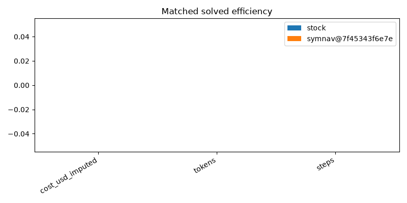

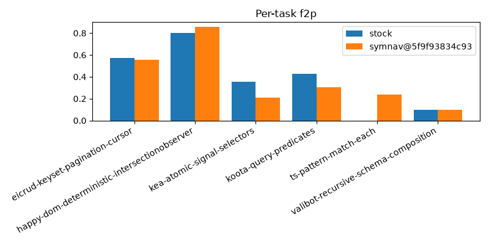
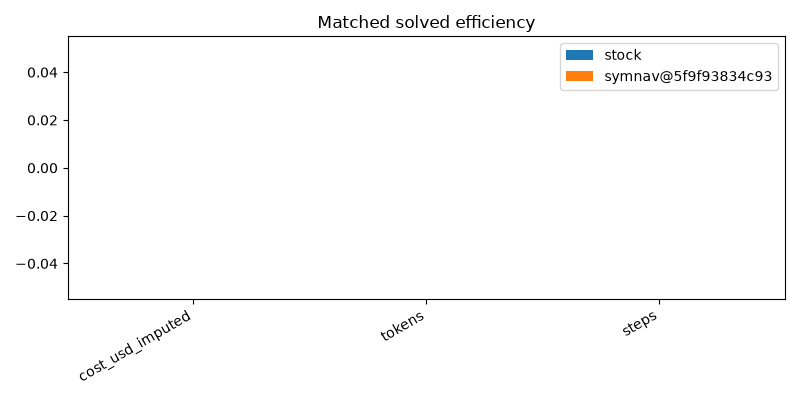
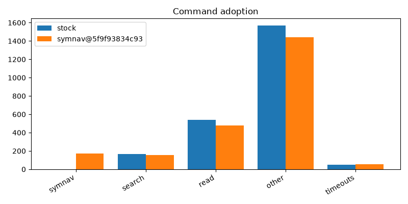
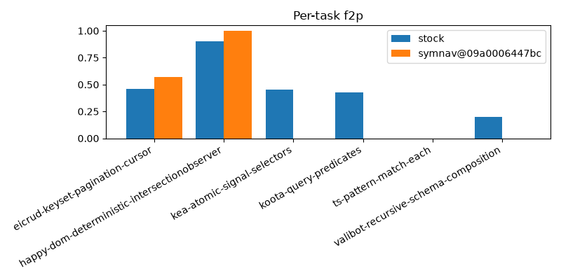
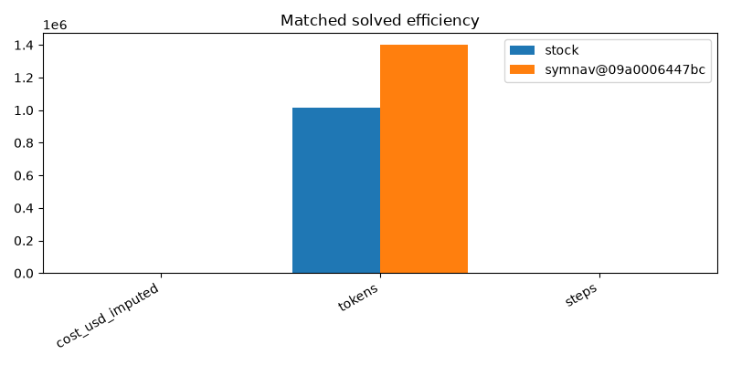
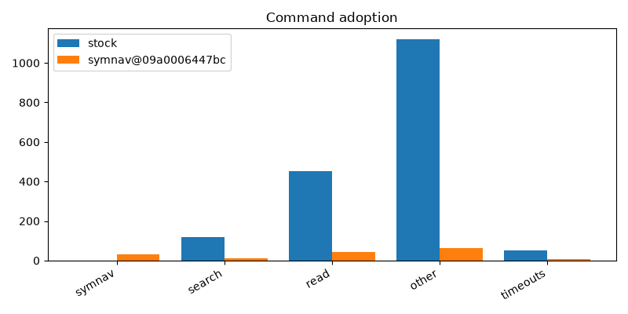
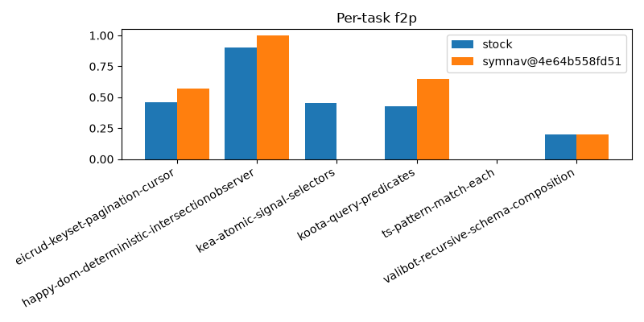
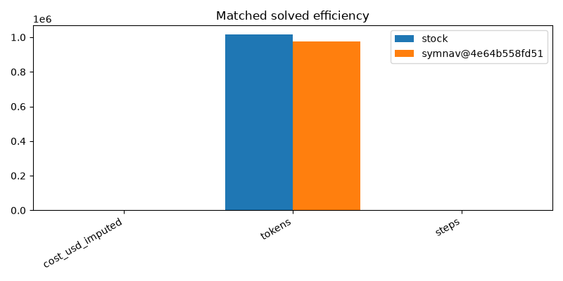

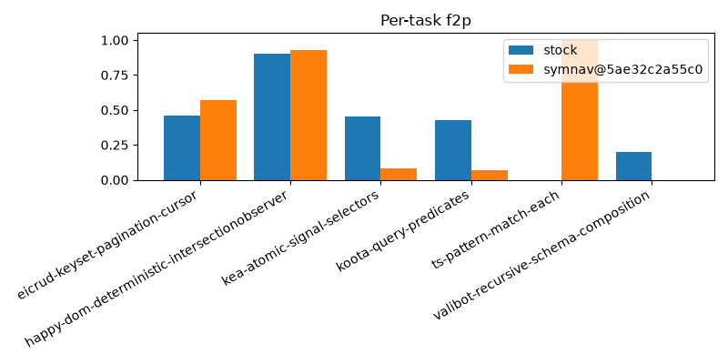
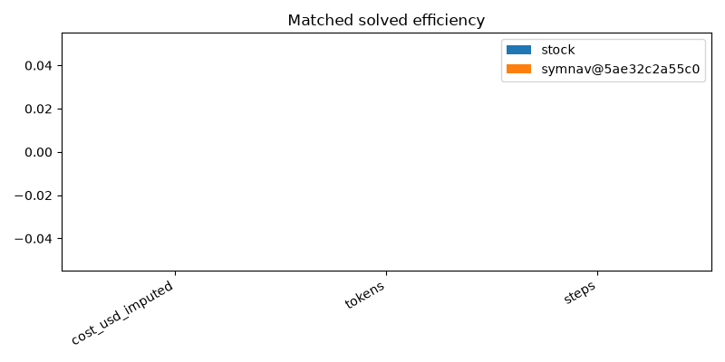
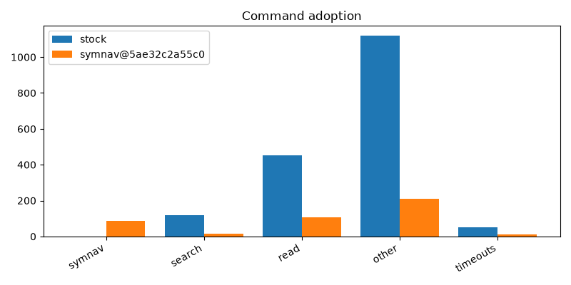
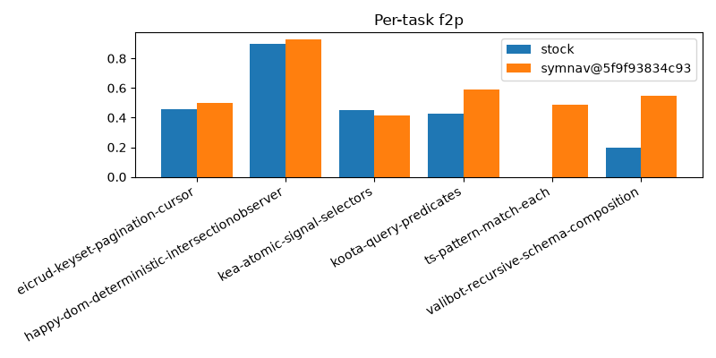
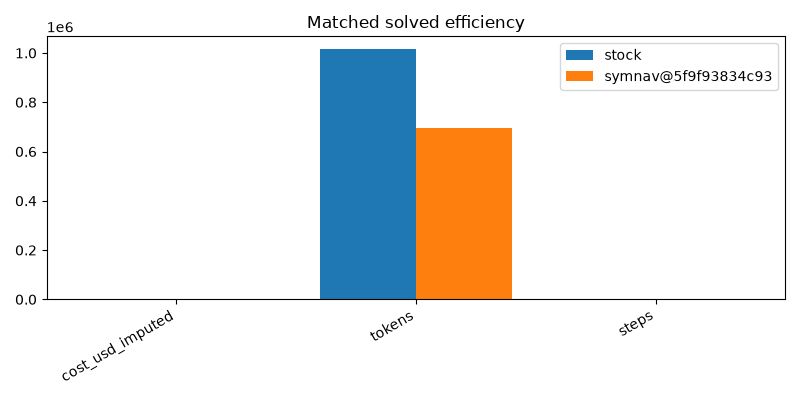
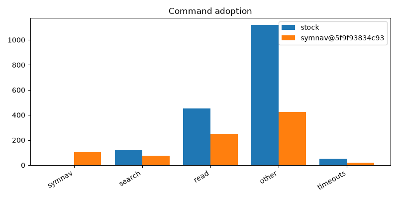

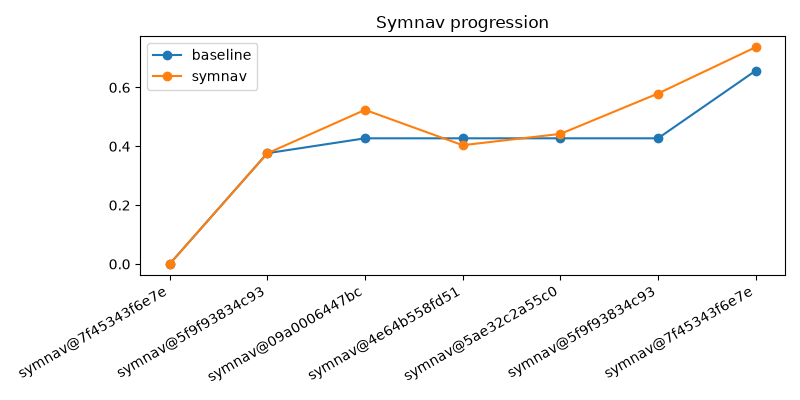
